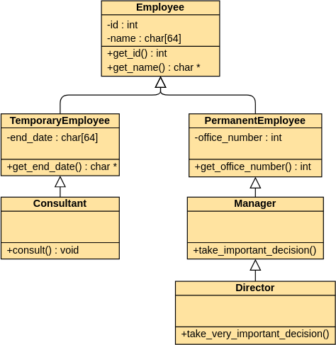

# Lecture 16 Problem 2

Class diagrams such as the one below are used to visually represent classes
(rectangles) with their member variables (items starting with "-") and
functions (items starting with "+"), as well as their inheritance
relationships.



The classes have a few member variables, constructors (not shown on the class
diagram above), and the classes `Consultant`, `Manager` and `Director` each
have a member function that prints some information. Example this printed
information can be found below in the expected output.

The program [inheritance2.cpp](inheritance2.cpp) creates and uses a few objects
from various classes:

```cxx 
#include <stdio.h>
#include "Employee.h"

int main(int argc, char **argv) {
    Consultant c(1234, "James", "15/01/2022", "Aerodynamics");
    Manager m(1212, "Stella", 10);
    Director d(1678, "Elon", 42);

    c.consult();
    m.take_important_decision();
    d.take_very_important_decision();
    return 0;
}
```

Write the files `Employee.h` and `Employee.cpp` containing the classes
definitions and implementations. Compiled with the program presented above,
it should produce the following output:

```shell
./inheritance2
[1234 - James] I'm consulting on Aerodynamics until 15/01/2022
[1212 - Stella] I'm taking an important decision in office 10
[1678 - Elon] I'm taking an very important decision in office 42
```

To check the correctness of your program, use CS50 [sandbox](sandbox.cs50.io)
or [IDE](ide.cs50.io) and write `Employee.cpp` and `Employee.h`. Along with
`inheritance2.cpp` in the local folder, use this command:
```shell
check50 -l --log olivierpierre/comp26020-problems/master/lecture16/inheritance2
```
